# CodeAuditAssistant

[English Version](./README_en.md)

**Author**：SpringKill、Unam4

**插件支持版本**：`IDEA >= 2022.3`

**Kotlin**：JDK17+

脱更很久终于和大家见面了，前`SecurityInspector` 的正式版`CodeAuditAssistant` 现在开启测试。

从24年11月拖更到25年的4月，我们团队和个人都经历了很多事情，不过好在一切基本已经尘埃落定。

在`卫界安全` 的资助下，我们将继续为大家持续提供开源项目，我们团队也将成为`卫界安全` 资助的开源团队，为大家带来更多的**可靠的**、**强大的**安全工具。

项目中还存在一些已知和未知的`bug` ，为了不让有`bug` 的源码被二次开发和有`bug` 的程序被广泛传播，本插件的使用方式暂时采用**授权激活**的形式，当收集了足够的`issue` 以及修复了更多的`bug` 将工具的可用性提升到另一个层次时，我们会将代码**全部开源**并邀请各位对代码安全感兴趣的师傅进行共同开发和维护。

## 感谢

以下师傅在插件开发过程中提供了相当多的建议和技术支持，十分感谢！

**技术支持**： Ar3h

**非技术贡献者**：zjacky

## 功能介绍

### 代码检查

`CodeAuditAssistant` 是一个代码审计辅助插件，其包含三部分功能：`Decompiler`、`Code Analysis`和`SinkFinder`，三个部分共同配合来实现强大的代码审计辅助。

#### SinkFinder

`SinkFinder` 内置了常见的`Java` 代码`Web`漏洞`sink` 点，高危组件调用`sink` 点，通过`Idea` 自身的`Problem` 模块进入，通过此模块你可以快速收集项目中的`Sink` 点：

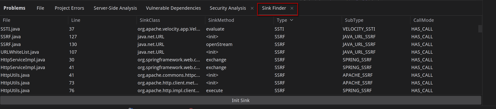

`Sink` 收集完毕后，双击即可跳转到代码所在位置：

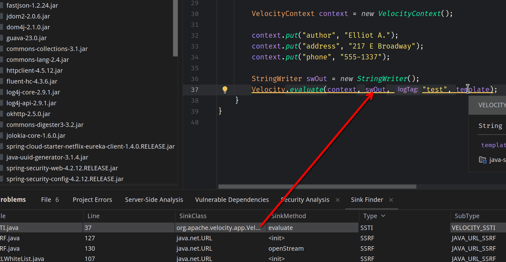

#### 反编译

反编译模块和原来目前没有更改，在列表中选择要反编译的`jar` 包后，点击`Run` 即可反编译回源代码（目前没有做任何优化、失败率高）。

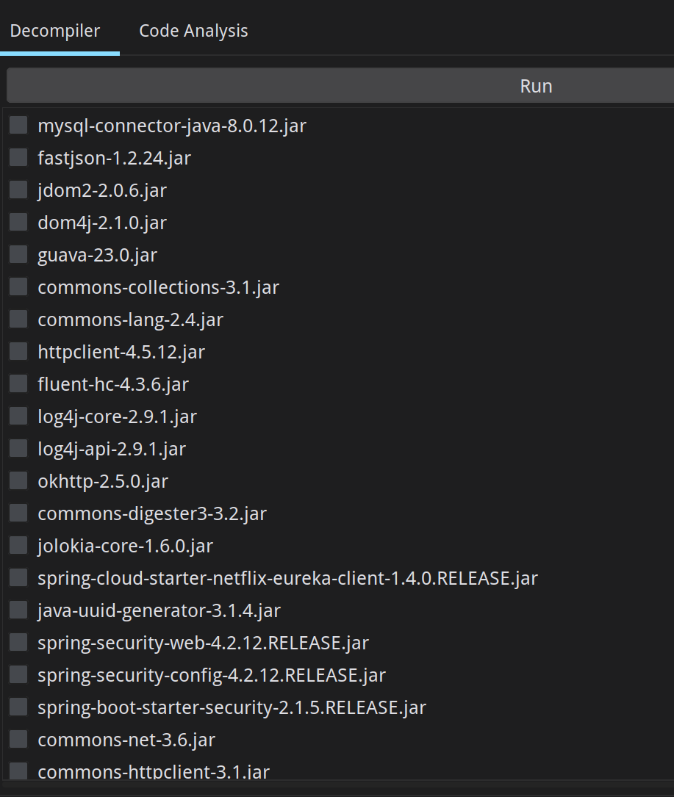

#### 代码分析

本次更新的最大内容是代码分析模块，通过此模块你可以快速查找一个方法的调用路径，下面逐步介绍功能：

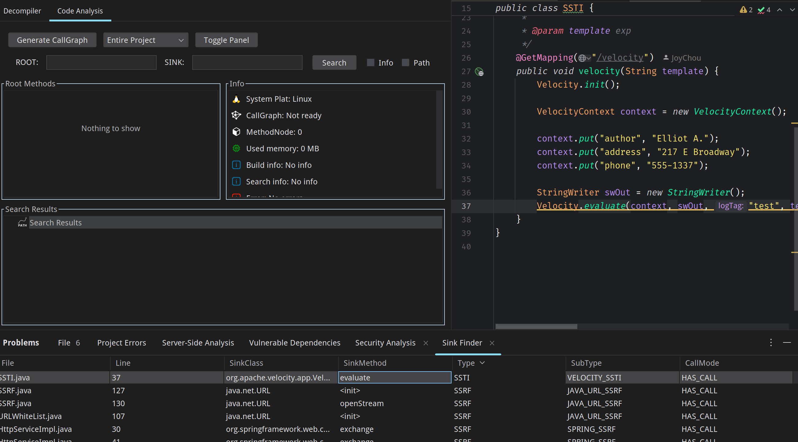

首先是功能区，`Generate CallGraph` 按钮用于生成项目的调用图，旁边的**下拉菜单**用来选取调用图的**构建范围**，如果你选择了`Entire` 则会对整个项目进行构建，如果你选择了`Selected Module` 那么在你点击`Generate CallGraph` 的时候就会弹出一个窗口用来选择构建范围。

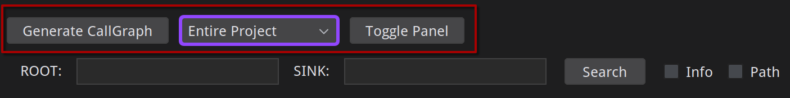
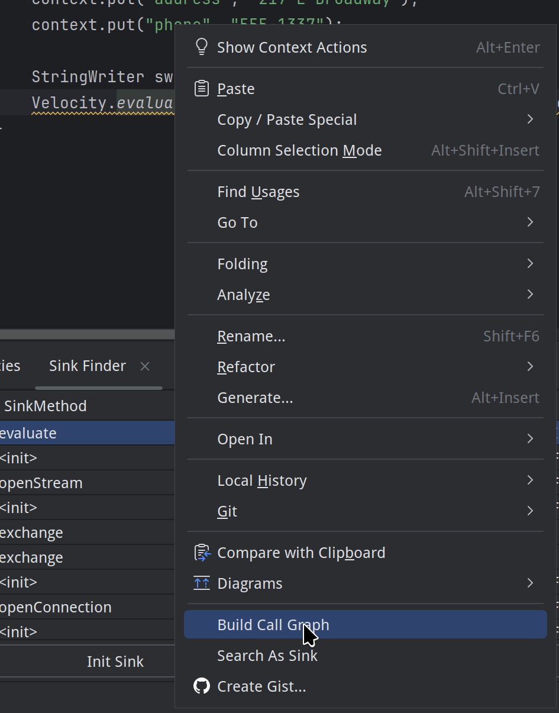

在构建图之前，你应该看到了界面上的两个复选框，这两个框分别代表：

`Info`：收集全部方法相关信息（用于按条件查找特定的方法）

`Path`：构建图时包含方法的调用路径（用于构建方法的调用关系）

一般情况下，如果你的代码量不是很大并且电脑内存充足，建议全都选上。

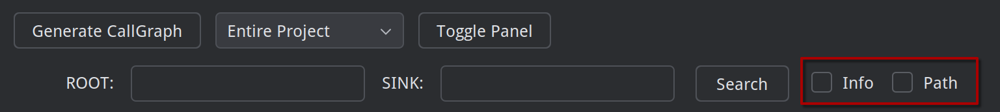

隐藏窗口：

点击此按钮可唤出一个隐藏窗口，如果在上一步构件图的时候你勾选了`Info` 就可以在这里快速按照条件查找想要的方法：

其中的`ParamType` 输入框需要使用全限定类名，用英文逗号分隔，并支持使用`*` 作为通配符，示例如下：

`java.lang.String,*` 用这个参数可以查找到所有第一个参数是`String` 类型，第二个参数是任意类型的方法。

其中`Annotations` 字段同样是用英文逗号分隔，但是不用写全限定类名，示例如下：

`@Override,@xxx` 用这个参数可以查找到所有拥有`Override`注解和`xxx`注解的方法。

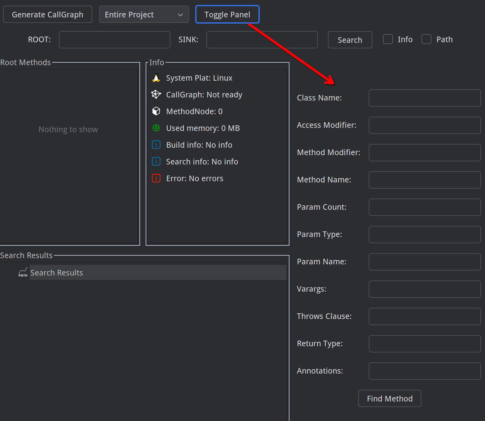

使用示例：

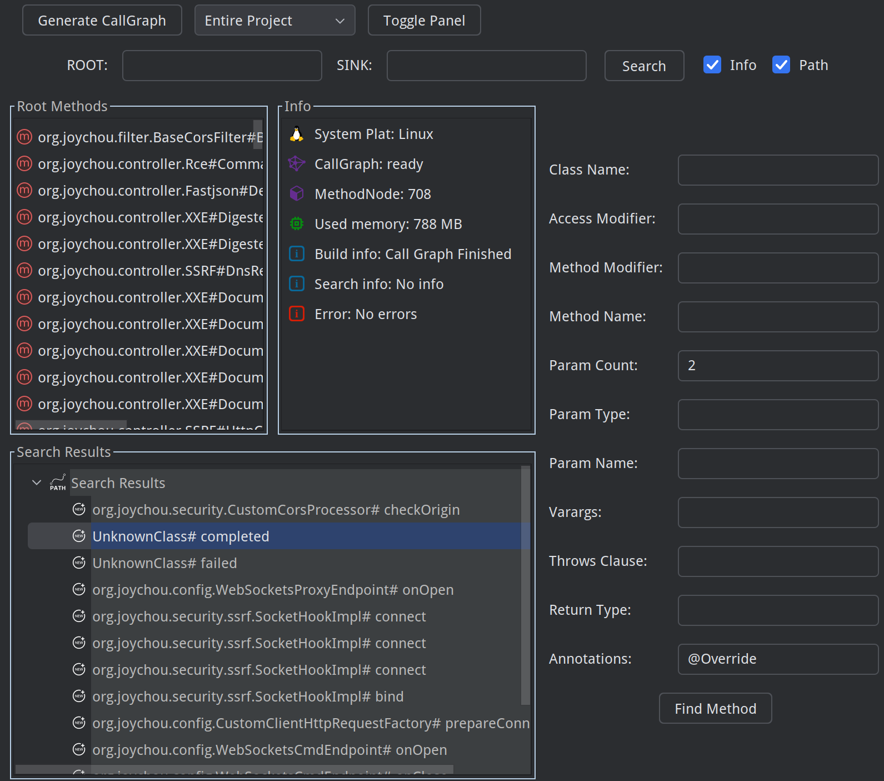

搜索路径：

当你完成了图的构建之后（进度条可能会因为你的工具窗口太窄而无法显示，你可以选择将工具窗口拖出来作为一个独立的窗口使用），就可以使用搜索功能进行搜索：

搜索有三种方式，第一种是如果你想要查找指定两个方法的调用路径，只需要将起始方法作为`ROOT`，将结束方法作为`SINK`然后点击`Search` 就可以快速搜索，搜索结果进行双击就能跳转到代码对应的位置（有可能不准确）：

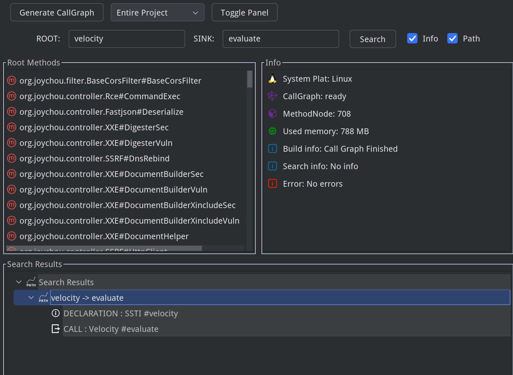

第二种方式是如果你不知道起点，只想找到某一个方法的调用链/位置的时候，单独输入`SINK` 也可以进行查找：

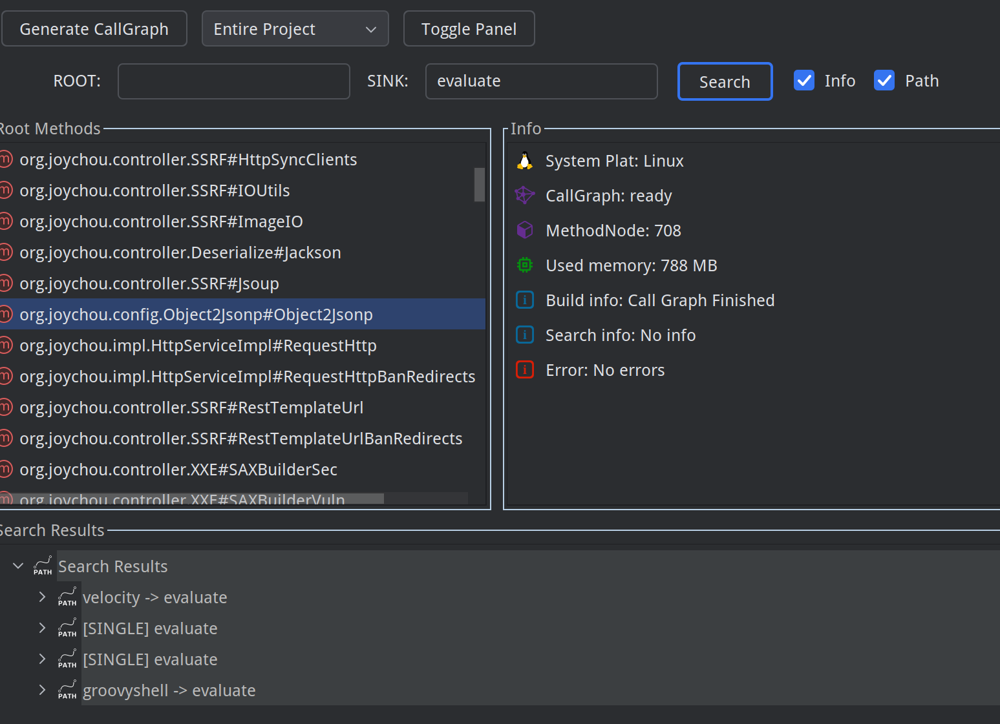

第三种方法是，当你在程序中发现了一个有趣的方法，并想查找所有能够调用到该方法的路径时，可以通过右键菜单中的`Search as sink` 进行搜索，点击后会自动将你选中的方法名填写到`SINK`搜索框中并自动运行搜索：

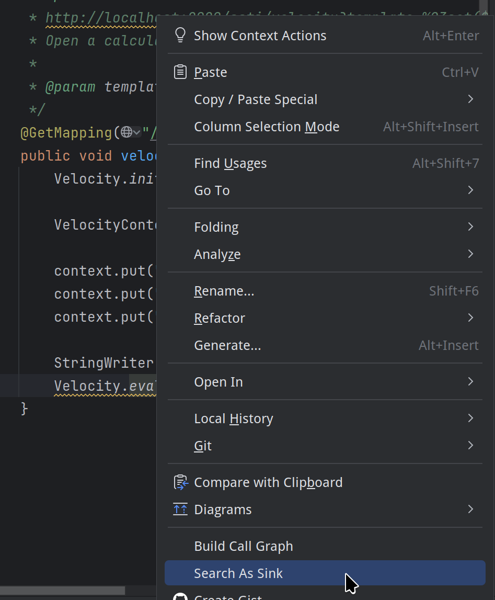

所有的结果折叠可以用`回车` 展开或重新折叠，所有的节点都可以双击跳转到指定的位置。

log4j检测示例：

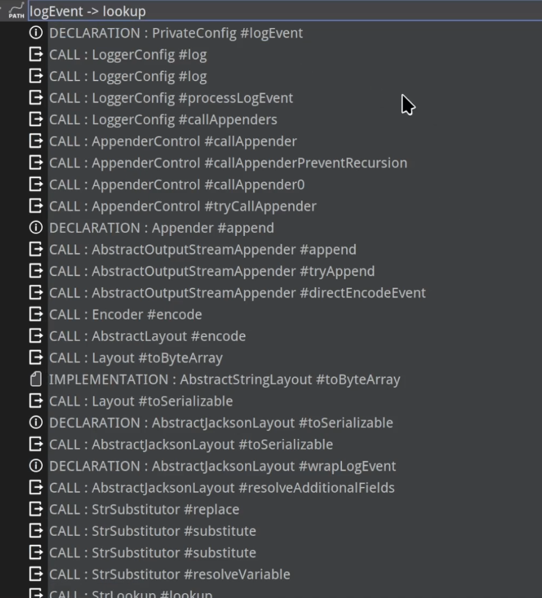

#### 展示界面

当你没有进行任何操作的时候，会看到如下界面：

其中`Root Methods`中用来展示所有的**没有被其他人调用的方法**。

`Info` 中用来展示一些提示信息，它会识别你的系统平台（方便提交ISSUE的时候进行识别），在没有构建图的时候`CallGraph` 的状态是Not Ready，只有当你成功构建图之后状态才会变成Ready。

`MethodNode`用来展示当前的调用图中有多少节点，以及下方会展示使用了多少内存，是否有提示信息或者报错信息等内容。

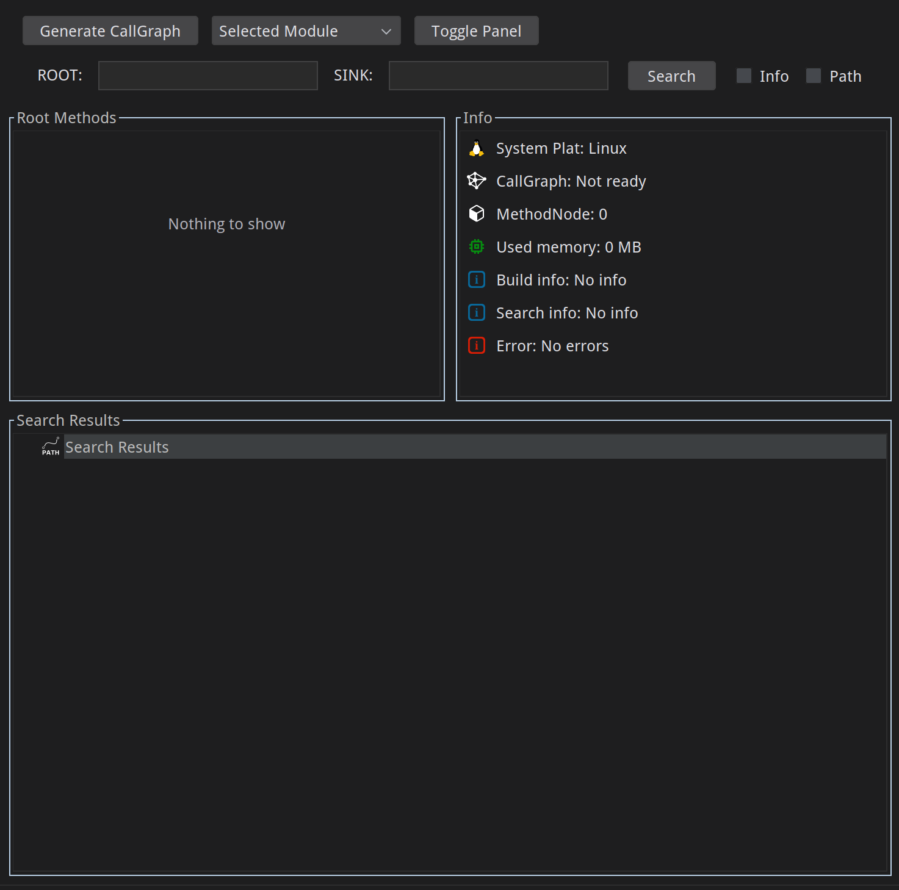

`Search Results`界面用来展示搜索结果：

 图标用来表示搜索路径  
 图标用来表示方法声明，也就是方法被定义的位置  
 用来表示方法的调用  
 用来展示对象的新建，当前版本也用来表示隐藏窗口中的方法的搜索结果 
`文件图标` 当前版本用来表示一个接口中的方法或者抽象类中的方法被实现或重写  

## 注意&功能开发

我们很关注您的代码安全，相信您也一样，所以在使用过程中如有想要的功能以及`bug` 等问题，请及时提出，我们会尽快进行优化/修复。

当前版本使用的路径搜索方法为`DFS` 算法，此方法对于两点中有多条路径的情况可能展示不全，当前可以采用分段搜索的方式进行查找，为了解决这个问题我们将做：

搜索功能优化

路径查找方法优化

图结构优化

当前版本的`CallGraph` 不能持久化保存，为此我们将做：

调用图持久化

方法变动监听

当前版本搜索时的`Root/Source` 可能重复，造成结果中有相同的路径，为此我们将做：

`Root/Source` 节点去重和路径去重

其他feature：

支持直接对lib jar的搜索，移除反编译

搜索结果高亮优化

……

欢迎各位师傅提出`Issue` 帮助项目改进！

## 关于后续版本

我们计划会在后期推出`Pro` 版本，在开源版中提出Issue并被采纳的师傅，我们会赠送`Pro` 的授权码。

`Pro` 版本不同于开源版本，会采用自研的特殊引擎以及特殊机制进行分析，`Pro`计划拥有以下功能：

`Pro` 版本的目的是为了一键精准识别漏洞，尽可能去除误报，支持一键生成报告，以图做到一键扫描，一键报告的形式，更适合刚刚入门代码审计但是直接需要报告的人群。

| 功能差异 |       开源版       |                PRO版                 |
| :------: | :----------------: | :----------------------------------: |
| 语言支持 |    全部JVM语言     |       更多语言（Python、go等）       |
| 污点分析 |     仅方法调用     |         更完善的污点分析能力         |
| 报告导出 |       不支持       |             支持导出报告             |
|   SCA    | 后续仅支持依赖分析 |       更加精准的调用级SCA分析        |
|  AI辅助  |         无         | 独创的AI分析模式，不同于市面任何产品 |
|    ……    |         ……         |                  ……                  |

## 授权

关于当前版本的授权问题，可联系公众号：卫界安全-阿呆攻防回复 `CodeAuditAssistant授权` 或 `代码审计工具授权` 进行获取，也可以添加我的个人微信（微信号：SpringKill_）进行交流，如果你认为这个项目对你有帮助，请点个小小的Star和Follow鼓励一下我吧～

## 交流
可以扫描下面二维码加入交流群，欢迎各位师傅。

## 结语

林地生长于漫宿墙外。每一个研习诸史的人都知道，漫宿无墙。
