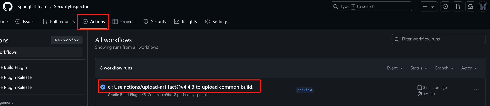
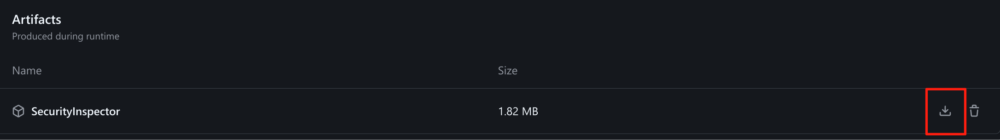
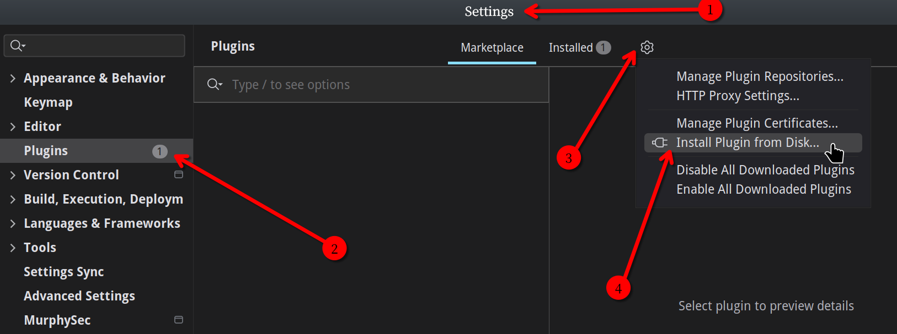
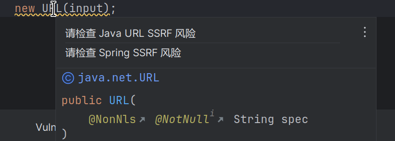
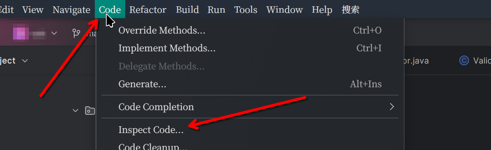
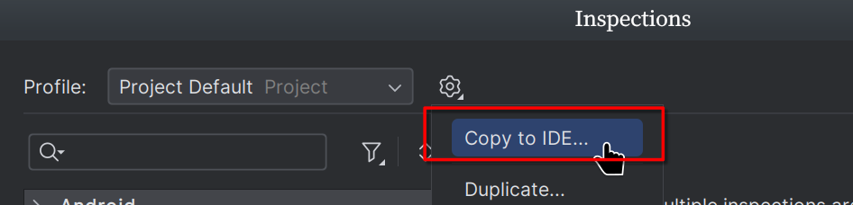
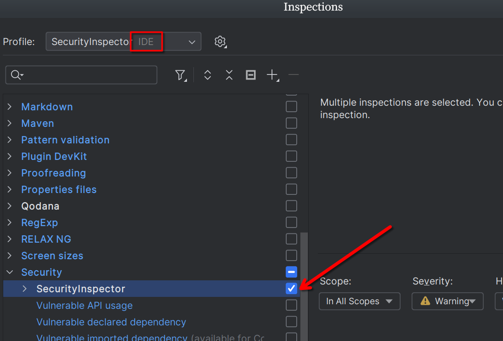
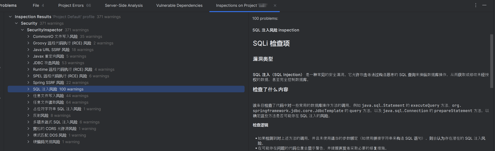
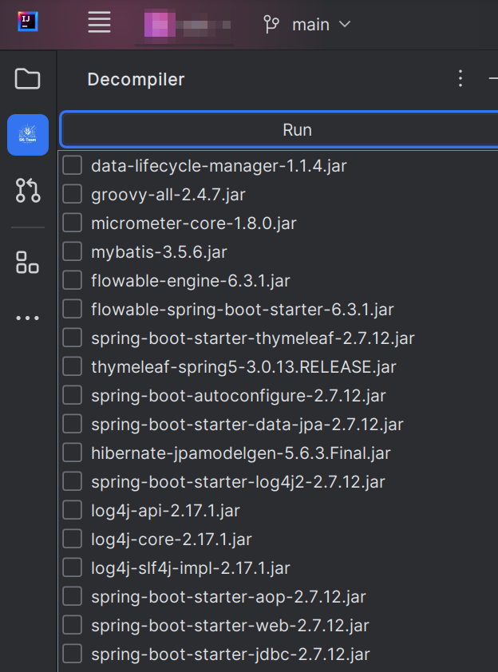
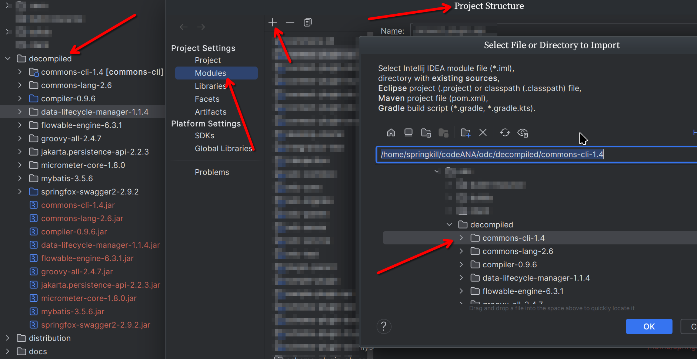

# SecurityInspector

**Author**：SpringKill、Unam4

**插件支持版本**：`IDEA >= 2023.2.6`

**Kotlin**：JDK17+

**感谢**：**深信服深蓝实验室天威战队**的开源项目[inspector](https://github.com/KimJun1010/inspector)，这个项目给了我们很多启发，本项目中包含很多相同的逻辑并做了优化

我们会对本项目进行持续更新和优化，并对规则进行持续维护，如在使用过程中遇到BUG或有新的功能想法以及建议，可以随时提交`ISSUE`，我们将第一时间进行解决。 

由于不会每个`commit`或者`bug`修复后都会发布新版本，所以在`workflow`中新增了每次`commit`后都上传临时版本的功能，可以在`Actions` 标签中的最后一次提交中下载

## 功能介绍

### 代码检查

`SecurityInspector` 是一个静态代码扫描插件，内置了常见的`Java` 代码`Web`漏洞`sink` 点，高危组件调用`sink` 点，识别项目中可能存在的过滤器（如`XSS`过滤器、`SQLI`过滤器等<此功能存在较多`bug` ，将会于正式版上线>），并使用`IDEA`的`PSI` 和`Intercept`机制来对以上内容进行快速定位。

通过本插件：

- 安全人员可以节省人工代码审计时的搜索时间。
- 开发人员可以在开发过程中随时注意可能存在的安全问题。

### 反编译

本插件还提供一个基于`FernFlower`的简单反编译模块，使用此模块可以快速识别：

- 当前项目中`lib`目录下的`jar`包
- `Maven` 项目中的依赖并从本地仓库中寻找`jar` 包

勾选需要反编译的`jar`包并反编译后即可将其还原回一个可以被`IDEA` 打开的`maven`项目。

## 使用方法

### 代码检查

使用`SecurityInspector` 很简单，只需要下载`release`中的`jar`文件并在`IDEA`中安装就可以了。

安装插件后，编写代码的过程中会实时产生`warning`来提示检查是否存在某种风险：

也可以使用`Code -> Inspect Code`功能扫描整个项目，寻找`sink`：

在弹出的选项中，配置一个新的配置文件：

对当前的配置文件选择`Copy to IDEA…`：

重命名后，修改检查规则，仅勾选`Security`选项卡中的`SecurityInspector` ：

在不更新插件和规则的情况下，以后每次扫描都使用这个配置文件就可以了：

扫描结果如下，可以定位到很多的sink：

### 反编译

如果你想同时对项目中的某个依赖或对某个没有源代码的`maven`项目`jar` 包进行代码扫描和代码审计，可以使用本项目提供的反编译功能：

选择你想要反编译的`jar` 包并点击`Run` ，这个操作会在你当前的项目下生成`decompiled`目录并将还原的项目保存到该目录下，你可以通过将`decompiled`目录下的目录添加为`module`来将其添加到当前项目的`PSI`中（有几率产生bug），并使用`Inspector`进行扫描：

## 结语

当前版本是预览版，正式版将在不久后测试完毕并与大家见面，欢迎各位大佬提供提供建议！