# CodeAuditAssistant

语言： [English](README.md) | **中文**

## 项目简介
CodeAuditAssistant 是一款用于 JVM 代码审计的 IntelliJ IDEA 插件，提供 Sink 收集、调用图分析和 JAR 反编译能力，帮助审计人员更快定位风险路径。

## 环境要求
- IntelliJ IDEA `>= 2022.3`
- JDK `17+`

## 核心功能
### 1) SinkFinder
内置常见 Java Web 漏洞 sink 规则及高危组件调用点。结果展示在 IDEA Problem 视图中，双击可跳转到代码位置。

### 2) 代码分析（调用图）
支持按 `Entire` 全项目或 `Selected Module` 模块生成调用图。搜索支持：
- `ROOT -> SINK` 路径搜索
- 仅 `SINK` 的反向调用链搜索
- 右键方法 `Search as sink` 快速搜索

方法筛选示例：
- `ParamType`：`java.lang.String,*`
- `Annotations`：`@Override,@xxx`

### 3) 反编译（实验性）
支持在插件界面中对 JAR 进行反编译，当前实现仍在优化中。

## 流程演示（截图）
### 1）SinkFinder 流程
步骤 1：在 IDEA Problem 视图中收集 sink 结果。  
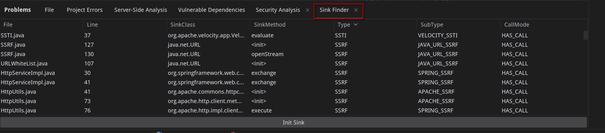

步骤 2：双击结果项可跳转到对应源码位置。  
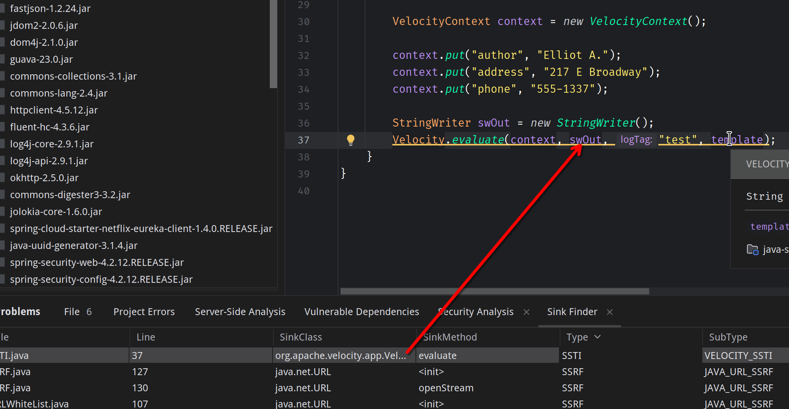

### 2）反编译流程
步骤 1：在反编译面板选择目标 JAR 后点击 `Run`。  
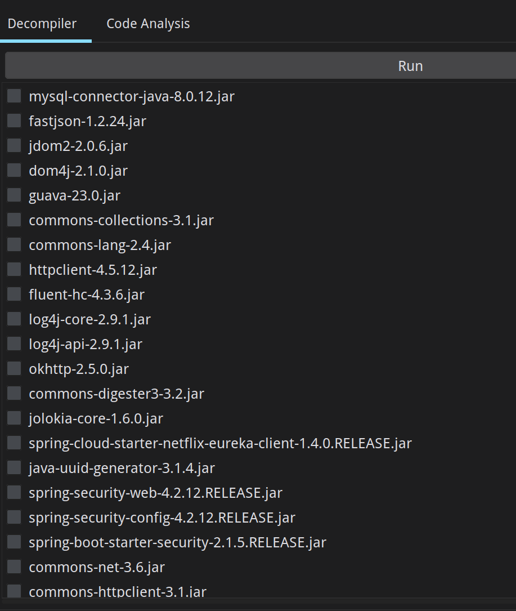

### 3）调用图流程
步骤 1：进入代码分析面板，点击 `Generate CallGraph`。  
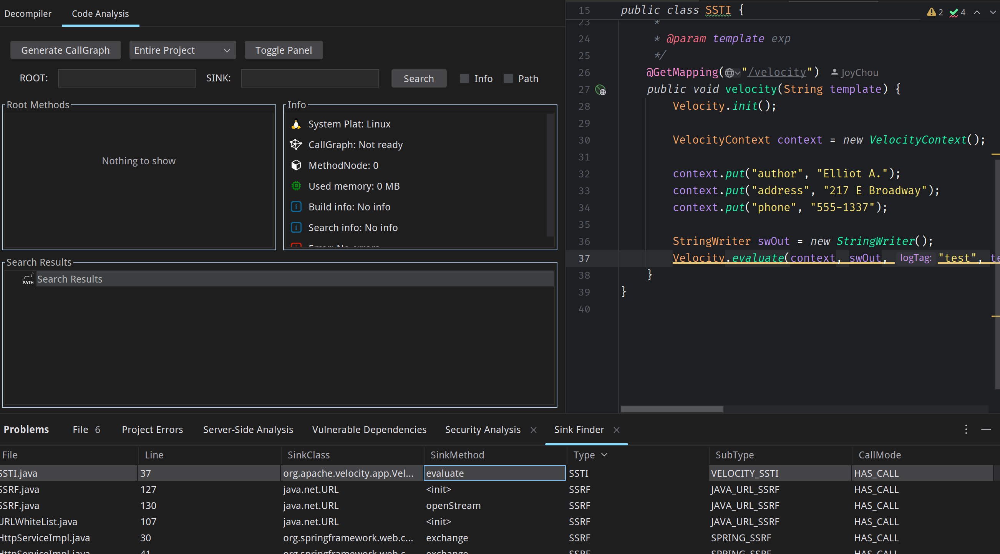

步骤 2：选择构建范围（`Entire` 或 `Selected Module`）。  
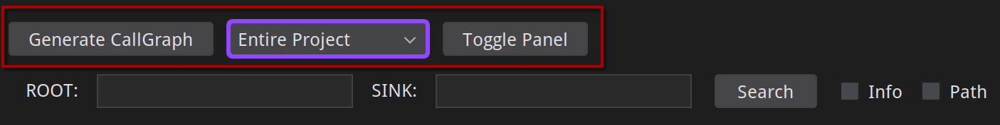

步骤 3：也可在编辑器中右键方法直接触发构建。  
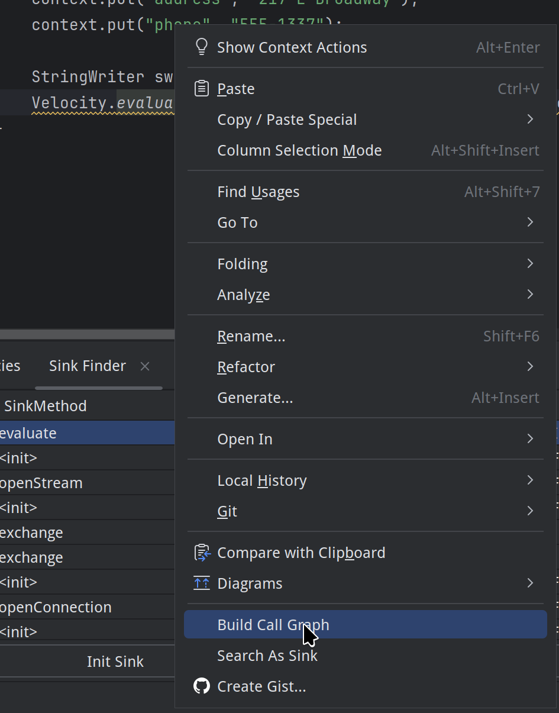

步骤 4：建议按需勾选 `Info` 与 `Path` 以获取更多信息和路径。  
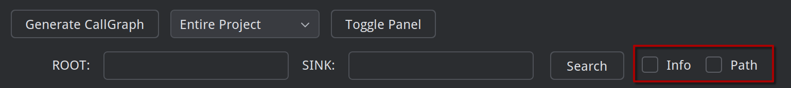

步骤 5：打开方法查找面板，按签名/注解筛选方法。  
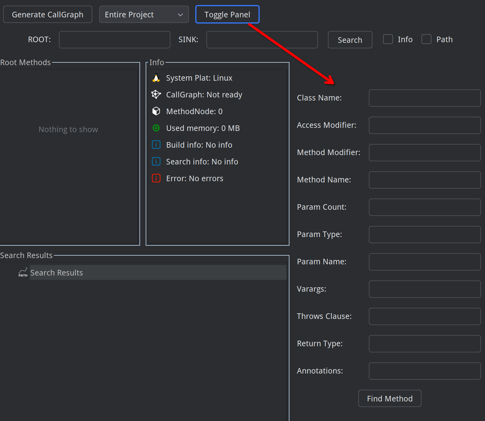

步骤 6：方法筛选结果示例。  
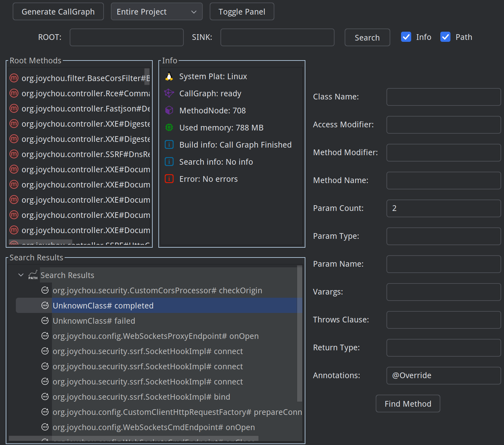

步骤 7：执行 `ROOT -> SINK` 路径搜索。  
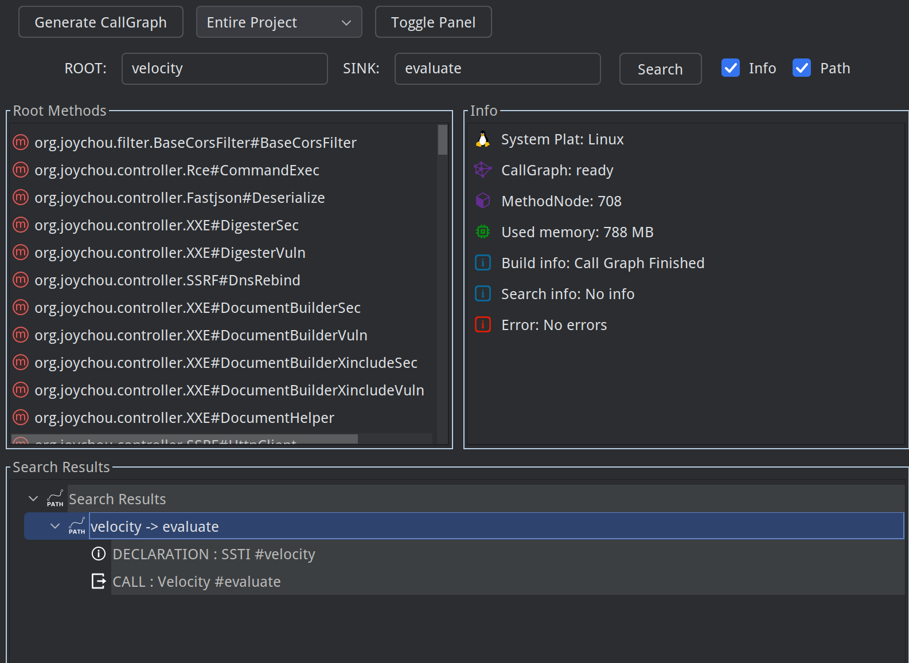

步骤 8：当起点未知时，使用仅 `SINK` 搜索。  
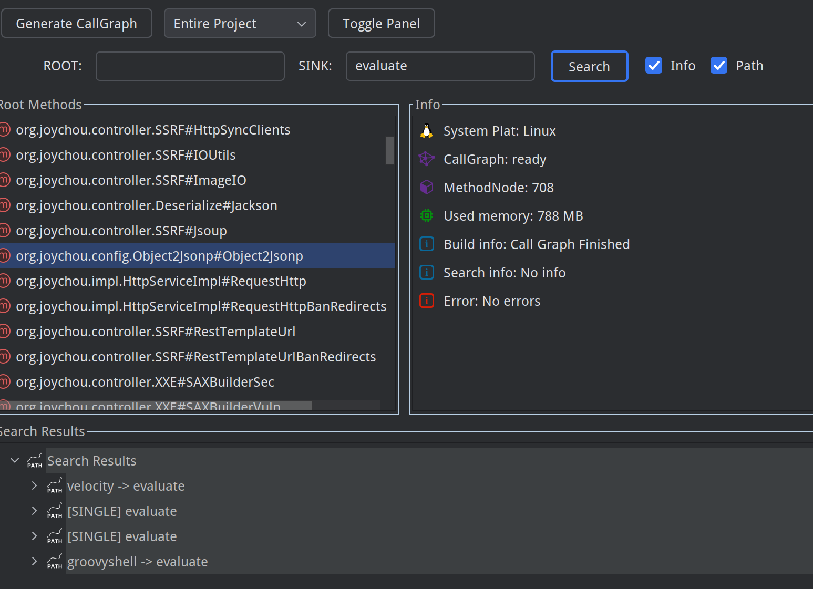

步骤 9：使用右键 `Search as sink` 自动填充并搜索。  
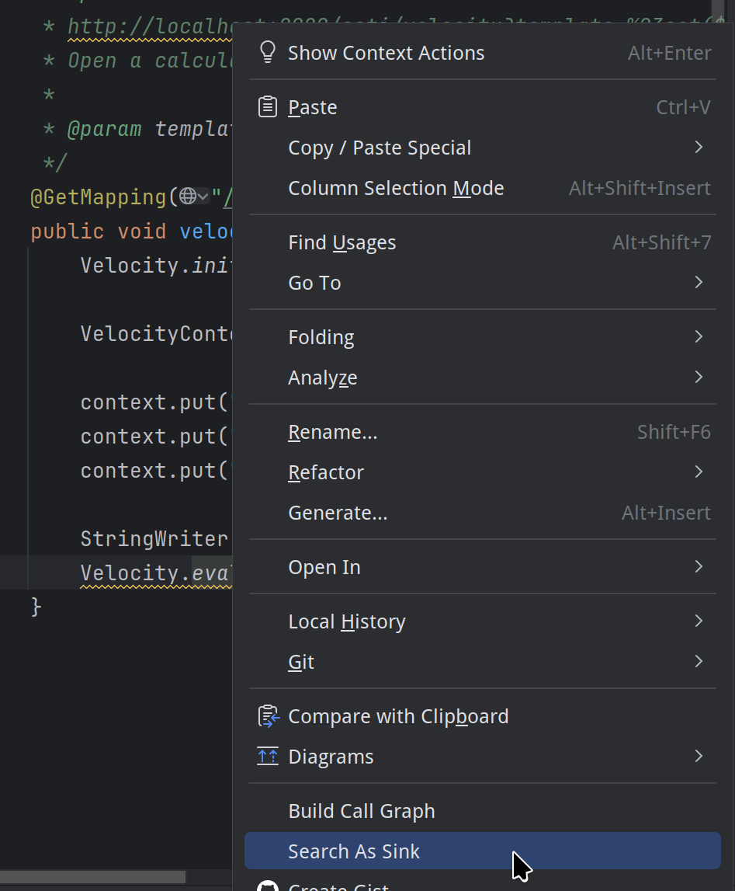

步骤 10：通过状态区查看 `CallGraph`、节点数、内存和提示信息。  
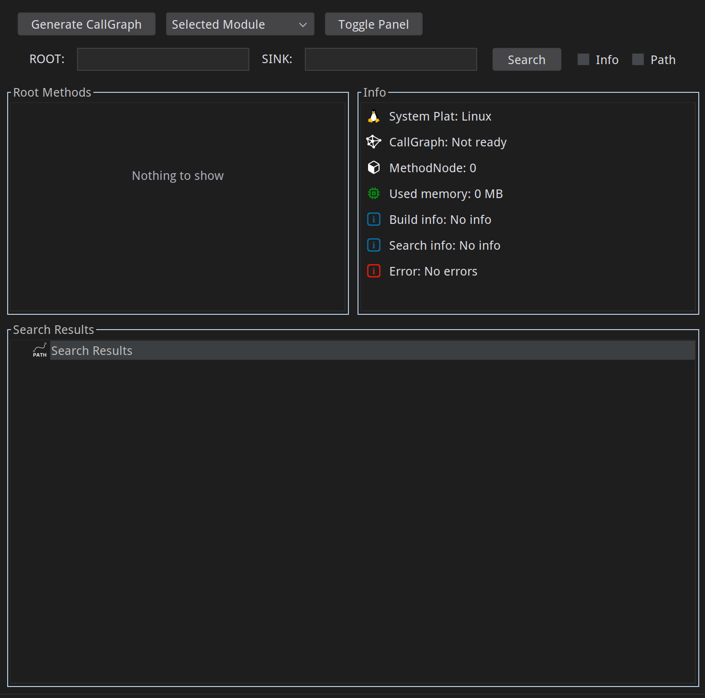

### 4）搜索结果图标说明
路径节点图标：  

方法声明图标：  

方法调用图标：  

对象创建 / 方法检索结果图标：  

## 构建与运行
- 构建插件产物：`./gradlew buildPlugin`
- 启动沙箱 IDE 调试：`./gradlew runIde`
- 完整构建：`./gradlew build`

## 已知限制
- 当前路径搜索基于 DFS，在复杂图中可能无法完整展示所有并行路径。
- 调用图暂不支持会话间持久化。
- 部分场景下根节点/源节点重复可能导致结果路径重复。

## 后续计划
- 优化路径搜索完整性与图结构模型。
- 增加调用图持久化与方法变更监听。
- 去重根节点/源节点及重复路径。
- 优化搜索结果高亮与第三方 JAR 分析流程。
