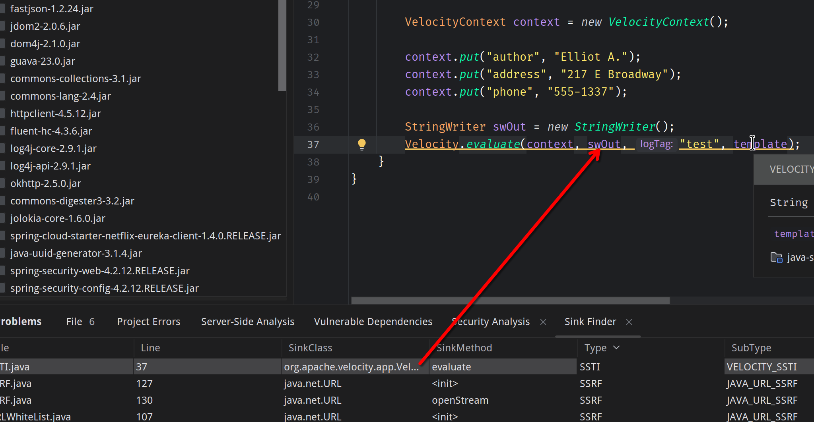
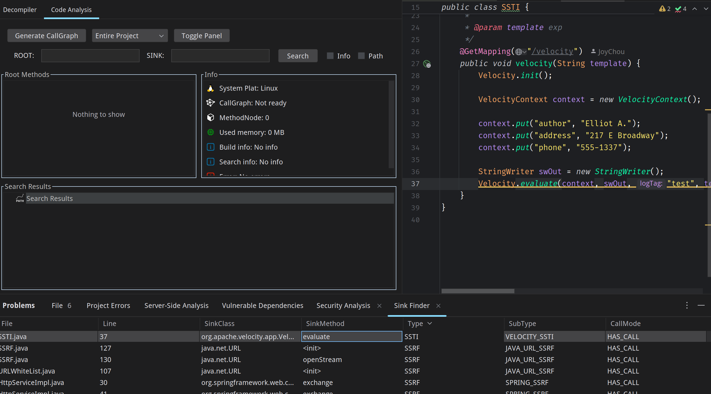
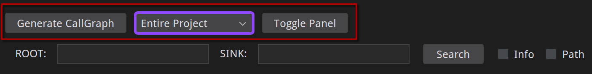
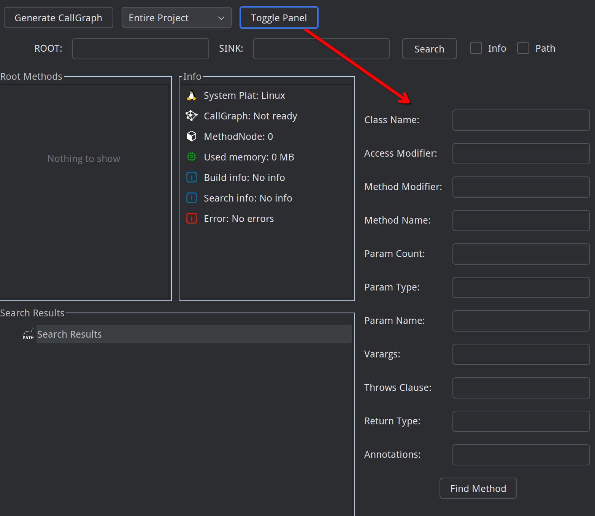
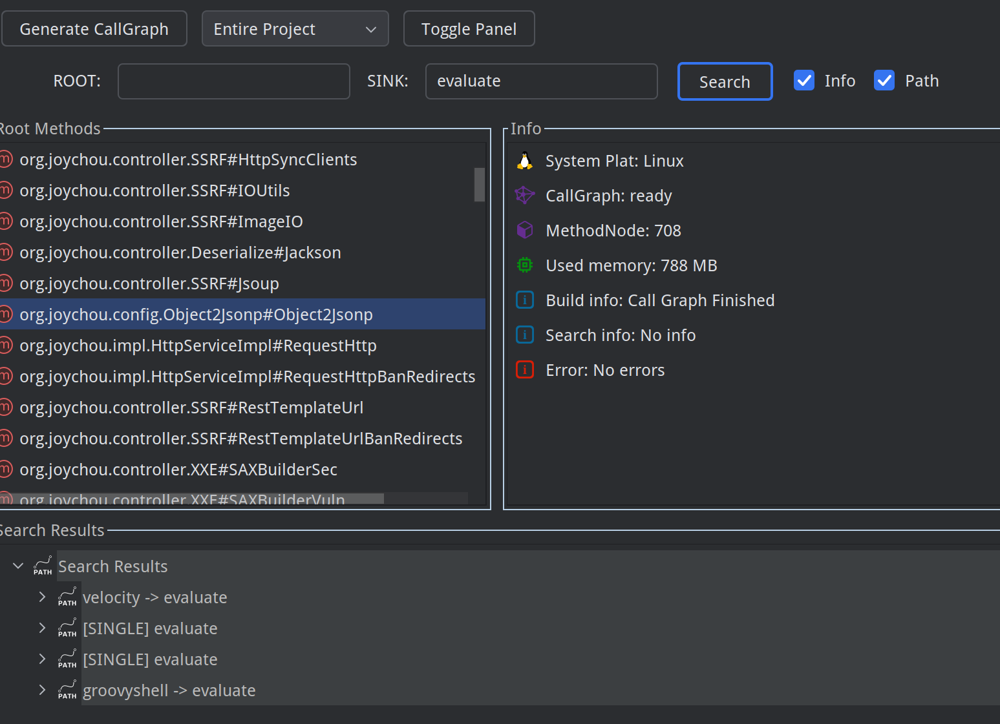
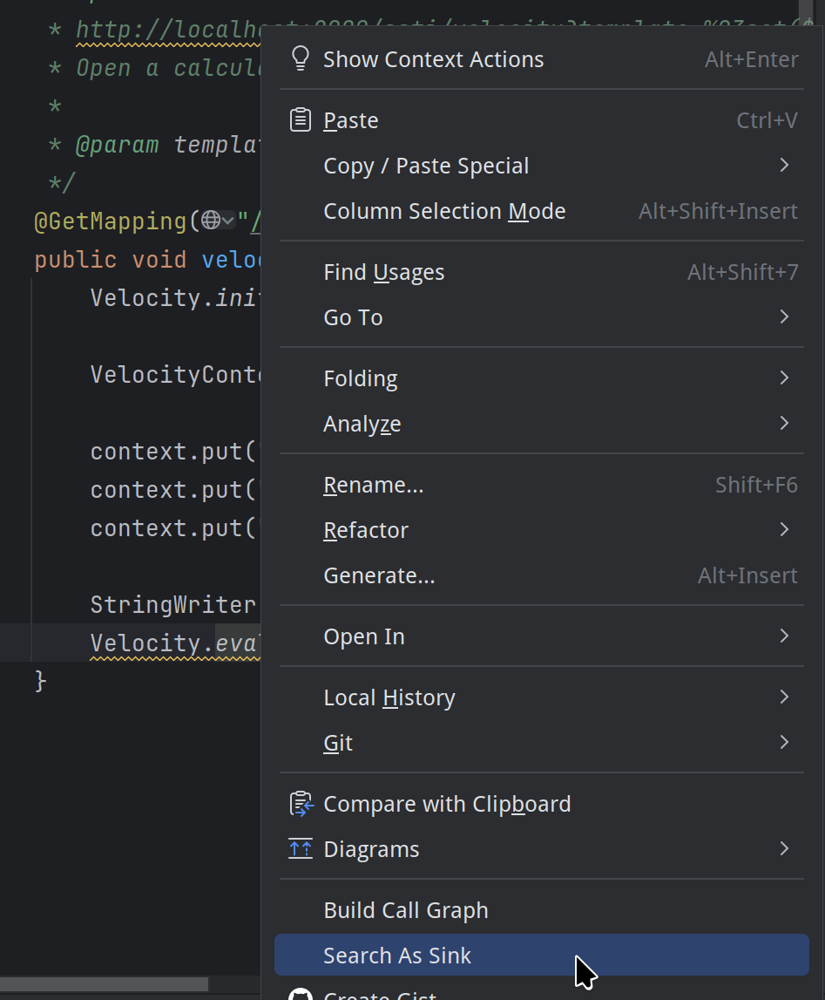
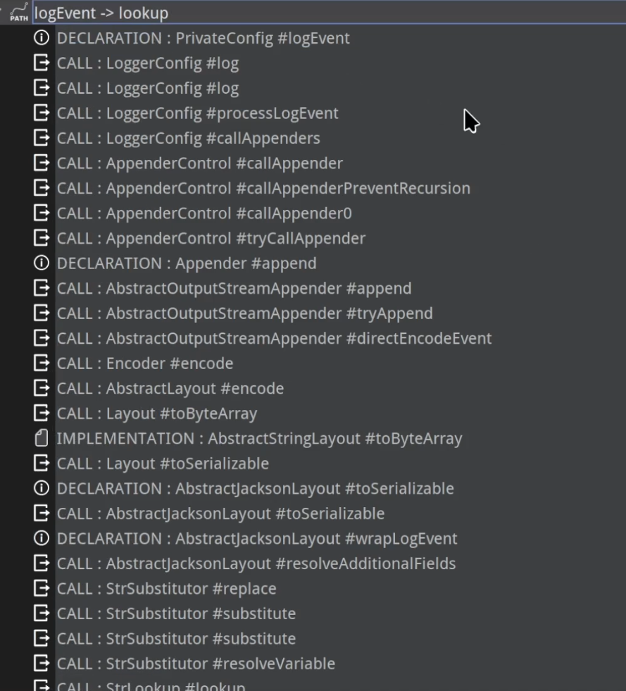

# CodeAuditAssistant

[中文版 (Chinese Version)](./README.md)

**Authors**: SpringKill, Unam4  
**Supported Plugin Version**: `IDEA >= 2022.3`  
**Kotlin**: JDK17+  

With the support of `Weijie Security`, we will continue to provide open-source projects for everyone. Our team has also become an open-source team sponsored by `Weijie Security`, aiming to bring you more **reliable** and **powerful** security tools.  

There are still some known and unknown `bugs` in the project. To prevent the buggy source code from being redeveloped or widely distributed, the plugin currently adopts an **authorization activation** model. Once we’ve collected enough `issues` and fixed more bugs to elevate the tool’s usability to the next level, we will **fully open-source the code** and invite security enthusiasts to collaborate on its development and maintenance.

## Acknowledgments

The following contributors have provided significant suggestions and technical support during the plugin’s development. A heartfelt thank you!  

**Technical Support**: Ar3h  
**Non-Technical Contributors**: zjacky  

## Features

### Code Inspection

`CodeAuditAssistant` is a code audit assistant plugin consisting of three main components: `Decompiler`, `Code Analysis`, and `SinkFinder`. These work together to provide powerful code auditing assistance.

#### SinkFinder

`SinkFinder` includes built-in common `Java` code `Web` vulnerability `sink` points and high-risk component call `sink` points. Through IDEA’s native `Problem` module, you can quickly collect `sink` points in your project:  

  

After collecting `sinks`, double-click to jump to the corresponding code location:  

  

#### Decompiler

The decompiler module remains unchanged from its previous version. Select a `jar` package from the list and click `Run` to decompile it back to source code (currently unoptimized with a high failure rate).  

  

#### Code Analysis

The biggest update in this release is the code analysis module, which allows you to quickly trace a method’s call path. Here’s a step-by-step introduction:  

  

First, the functional area: The `Generate CallGraph` button generates the project’s call graph, and the adjacent **dropdown menu** selects the **scope** of the call graph. Choosing `Entire` builds the graph for the entire project, while `Selected Module` prompts a window to select the scope when you click `Generate CallGraph`.  

  
  

Before building the graph, you’ll notice two checkboxes:  

- `Info`: Collects all method-related information (for conditional method searches).  
- `Path`: Includes method call paths in the graph (for building call relationships).  

If your codebase isn’t too large and your computer has sufficient memory, we recommend checking both.  

  

Hidden Window:  

Clicking this button reveals a hidden window. If you selected `Info` during graph building, you can quickly search for methods by conditions here:  

The `ParamType` field requires fully qualified class names, separated by commas, and supports `*` as a wildcard. Example:  

`java.lang.String,*` finds all methods with a first parameter of `String` and any second parameter.  

The `Annotations` field is also comma-separated but doesn’t require fully qualified names. Example:  

`@Override,@xxx` finds all methods with `Override` and `xxx` annotations.  

  

Usage Example:  

  

Search Paths:  

After building the graph (the progress bar may not display if the tool window is too narrow; consider dragging it out as a separate window), you can use the search function:  

There are three search methods:  
1. To find a call path between two methods, set the starting method as `ROOT` and the ending method as `SINK`, then click `Search`. Double-click the results to jump to the code (may not always be accurate):  

  

2. If you don’t know the starting point and only want to find a method’s call chain/location, input only the `SINK`:  

  

3. When you find an interesting method in the code and want to trace all paths leading to it, use the right-click menu’s `Search as sink`. This auto-fills the selected method into the `SINK` field and runs the search:  

  

All results can be expanded/collapsed with `Enter`, and all nodes can be double-clicked to jump to their locations.  

Log4j Detection Example:  

  

#### Display Interface

When idle, you’ll see this interface:  

- `Root Methods`: Displays all methods **not called by others**.  
- `Info`: Shows tips and identifies your system platform (useful for submitting ISSUEs). The `CallGraph` status is "Not Ready" until a graph is successfully built, then it becomes "Ready".  
- `MethodNode`: Shows the number of nodes in the current call graph, memory usage, and any tips or error messages.  

  

The `Search Results` interface displays search outcomes:  

 Icon for search paths  
 Icon for method declarations (where methods are defined)  
 Icon for method calls  
 Icon for object creation (also used for hidden window search results in this version)  
`File Icon`: Indicates methods in interfaces or abstract classes being implemented/overridden  

### Notes & Feature Development

We care about your code security, and we believe you do too. Please report any desired features or `bugs` promptly, and we’ll optimize/fix them as soon as possible.  

The current version uses the `DFS` algorithm for path searching, which may not display all paths in cases with multiple routes. For now, use segmented searches. Planned improvements include:  

- Search function optimization  
- Path-finding method optimization  
- Graph structure optimization  

The current `CallGraph` cannot be persistently saved. Planned features include:  

- Call graph persistence  
- Method change monitoring  

Duplicate `Root/Source` nodes in searches may lead to redundant paths. Planned fixes include:  

- `Root/Source` node deduplication and path deduplication  

Other features:  

- Direct search support for lib jars, removing decompilation  
- Search result highlighting optimization  
- …  

We welcome all security enthusiasts to submit `Issues` to help improve the project!

### About Future Versions

We plan to launch a `Pro` version later. Contributors whose Issues are adopted in the open-source version will receive a `Pro` authorization code.  

Unlike the open-source version, the `Pro` version will use a proprietary engine and mechanisms for analysis, offering:  

The `Pro` version aims for one-click accurate vulnerability detection, minimizing false positives, and supporting one-click report generation—ideal for beginners needing quick audit reports.  

| Feature Differences | Open-Source Version | Pro Version                          |
| :-----------------: | :-----------------: | :----------------------------------: |
| Language Support    | All JVM Languages   | More languages (Python, Go, etc.)    |
| Taint Analysis      | Method Calls Only   | Enhanced taint analysis              |
| Report Export       | Not Supported       | Supported                            |
| SCA                 | Dependency Analysis | More precise call-level SCA analysis |
| AI Assistance       | None                | Unique AI analysis mode              |
| …                   | …                   | …                                    |

### Authorization

For authorization of the current version, please send an email to springkill@163.com or contact me through X @chun_springX. 

If you find this project helpful, please give it a small Star and Follow to encourage me~  

### Conclusion

The forest grows beyond the walls of Mansu. Every student of history knows that Mansu has no walls.
